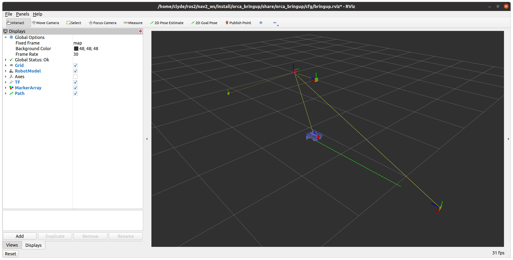

# Orca3

Orca3 is a set of [ROS2](http://www.ros.org/) packages that provide basic AUV (Autonomous Underwater Vehicle)
functionality for a [BlueRobotics BlueROV2](https://www.bluerobotics.com).

Localization uses the BlueROV2 barometer sensor as well as 6DoF poses generated by observing ArUco markers placed in
the environment.
* [fiducial_vlam](https://github.com/ptrmu/fiducial_vlam)
* [Base controller and localization details](orca_base/README.md)

Orca3 uses the ROS2 [Navigation2](https://navigation.ros.org/index.html) framework for mission planning and navigation.
Several Nav2 plugins are provided to work in a maritime environment:
* straight_line_planner_3d
* pure_pursuit_3d
* progress_checker_3d
* goal_checker_3d
* [Nav2 plugin details](orca_nav2/README.md)

Orca3 is simulated in Gazebo. Several Gazebo plugins are provided to support a maritime environment:
* OrcaDragPlugin
* OrcaBuoyancyPlugin
* OrcaThrusterPlugin
* OrcaBarometerPlugin
* [Gazebo plugin details](orca_gazebo/README.md)

## Installation

1. [Install ROS2 Foxy as described in the official docs](https://index.ros.org/doc/ros2/Installation/Foxy/)
2. Use your favorite Python package manager to install `transformations.py`
3. Download and build Orca3 and related packages:

    ~~~
    mkdir -p ~/ros2/orca_ws/src
    cd ~/ros2/orca_ws/src
    git clone https://github.com/clydemcqueen/orca3.git
    git clone https://github.com/clydemcqueen/sim_fiducial.git
    git clone https://github.com/clydemcqueen/ukf.git
    git clone https://github.com/ptrmu/fiducial_vlam.git
    git clone https://github.com/ptrmu/ros2_shared.git
    cd ~/ros2/orca_ws
    source /opt/ros/foxy/setup.bash
    rosdep install -y --from-paths . --ignore-src  # You may have to run "rosdep init" first
    colcon build
    ~~~
   
## Running the Simulation

In a terminal run:

~~~
cd ~/ros2/orca_ws
source /opt/ros/foxy/setup.bash
source install/local_setup.bash
export GAZEBO_MODEL_PATH=${PWD}/install/sim_fiducial/share/sim_fiducial/models
source /usr/share/gazebo/setup.sh
ros2 launch orca_bringup sim_launch.py
~~~

This will start Gazebo, Rviz2 and a number of Orca2 and Nav2 nodes. 
If everything has started correctly, you will see Gazebo and Rviz2 GUIs like this:

The surface of the water is at Z=0, and the AUV is slightly buoyant, so it will be sitting at the surface.
There's one ArUco marker directly in front of the AUV to provide a good initial pose.
There are two more AUV markers 2 meters below the surface, facing each other 10 meters apart.

Execute a mission by calling the `FollowWaypoints` action in a second terminal:

~~~
# Aligns with markers on the ping-pong map
ros2 action send_goal /FollowWaypoints nav2_msgs/action/FollowWaypoints "{poses: [\
{header: {frame_id: 'map'}, pose: {position: {x: 4, z: -2}}},\
{header: {frame_id: 'map'}, pose: {position: {x: -4, z: -2}}},\
{header: {frame_id: 'map'}, pose: {position: {x: 4, z: -2}}},\
{header: {frame_id: 'map'}, pose: {position: {x: -4, z: -2}}},\
]}"
~~~ 

This mission will dive to -2 meters, then ping-pong between the two submerged markers.
The AUV will only trust a marker pose if the marker is within 2 meters, so it will run dead-reckoning ~7 meters
between the markers. As the AUV approaches a marker and gets a good pose, the dead-reckoning
error is added to the map->odom transform.

## Packages

* [`orca_base` Base controller and localization](orca_base)
* [`orca_bringup` Launch files](orca_bringup)
* [`orca_description` URDF file](orca_description)
* [`orca_gazebo` Gazebo plugins](orca_gazebo)
* [`orca_msgs` Custom messages](orca_msgs)
* [`orca_nav2` Nav2 plugins](orca_nav2)
* [`orca_shared` Dynamics model, shared utilities](orca_shared)

## Future work

The project is under heavy development. Planned work:

* Another field test w/ my modified BlueROV2
* Nav2 recovery plugin(s) for underwater environments with ArUco markers
* Use VIO along the seafloor
* Use GPS at the surface