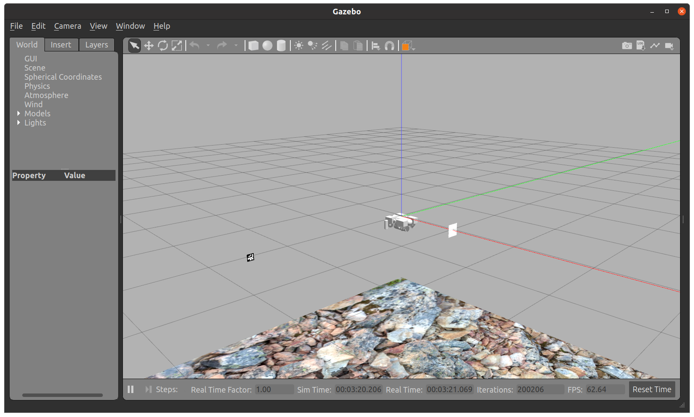
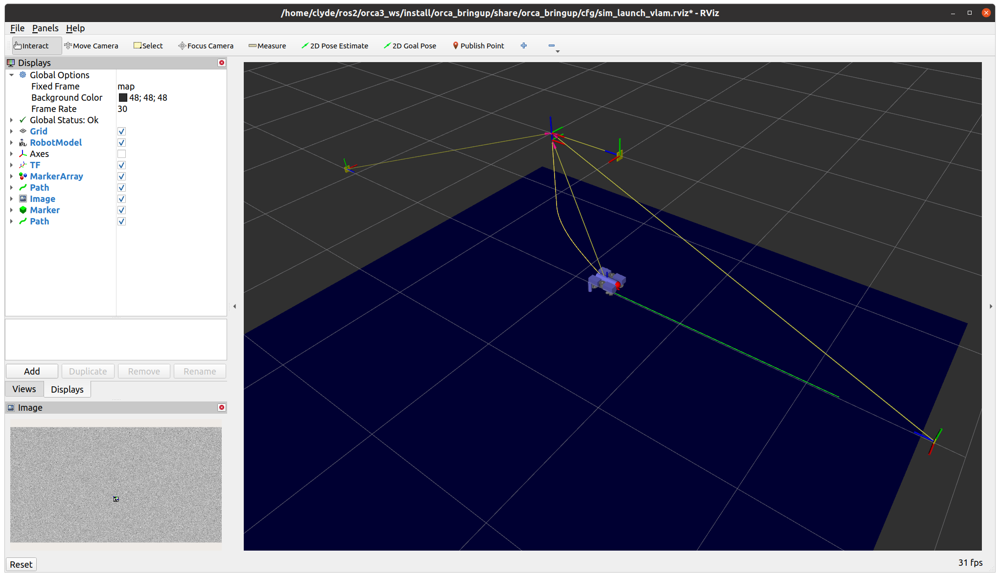
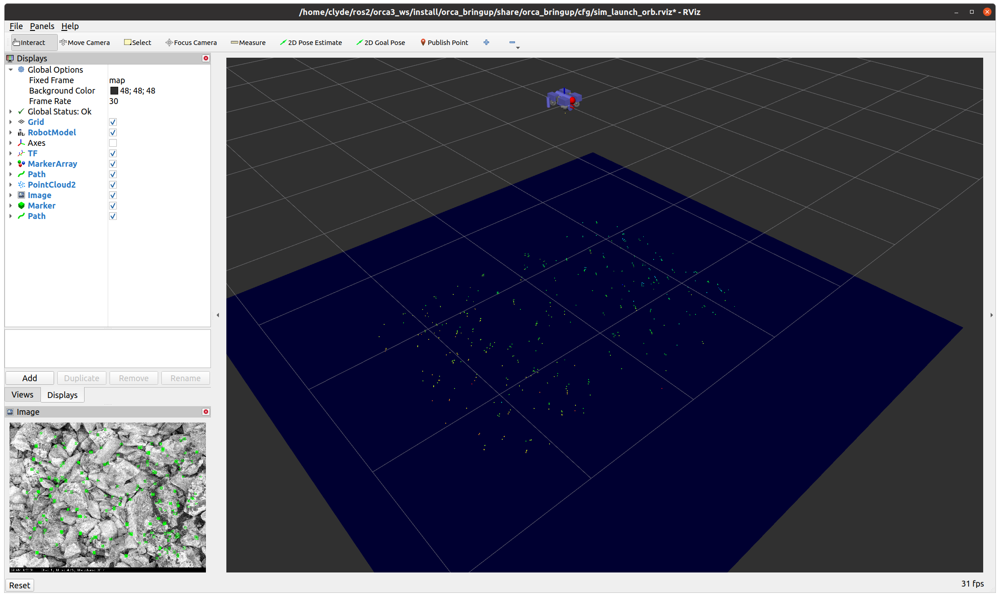
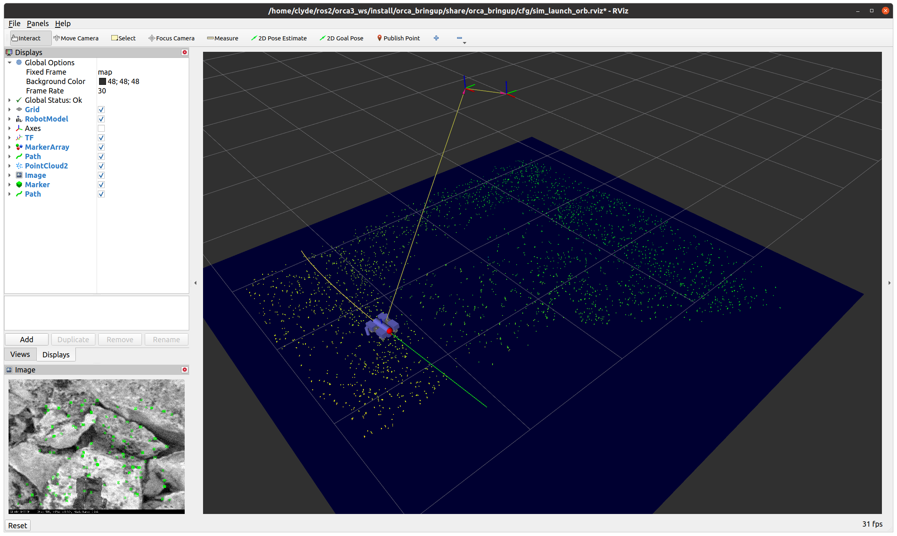

# Orca3 

Orca3 is a set of [ROS2](http://www.ros.org/) packages that provide basic AUV (Autonomous Underwater Vehicle)
functionality for the [BlueRobotics BlueROV2](https://www.bluerobotics.com).

Orca3 includes a `base_controller` node that responds to 3D 4DoF `/cmd_vel` messages and generates thrust and odometry.
The BlueROV2 barometer sensor is used to hover at the target depth.
See [orca_base](orca_base/README.md) for details.

Orca3 supports two SLAM (Simultaneous Localization And Mapping) systems:
* [fiducial_vlam](https://github.com/ptrmu/fiducial_vlam) looks for ArUco markers in the environment
  using the forward-facing camera.
* [orb_slam2_ros](https://github.com/clydemcqueen/orb_slam_2_ros/tree/clyde_rotate_pointcloud) looks for ORB features
  along the seafloor. It is currently configured to use a custom down-facing stereo camera, but the underlying
  ORB-SLAM2 system also works with depth and monocular cameras.
* [Localization details](orca_localize/README.md)

Orca3 uses the ROS2 [Navigation2](https://navigation.ros.org/index.html) framework for mission planning and navigation.
Several Nav2 plugins are provided to work in a maritime environment:
* straight_line_planner_3d
* pure_pursuit_3d
* progress_checker_3d
* goal_checker_3d
* [Nav2 plugin details](orca_nav2/README.md)

Orca3 is simulated in Gazebo 11. Several Gazebo plugins are provided to support a maritime environment:
* OrcaDragPlugin
* OrcaBuoyancyPlugin
* OrcaThrusterPlugin
* OrcaBarometerPlugin
* [Gazebo plugin details](orca_gazebo/README.md)

Orca3 includes experimental hardware drivers that run on a modified BlueROV2:
* BarometerNode reads the barometer and sends `/barometer` messages
* DriverNode responds to `/thrust`, `/lights` and `/camera_tilt` messages
* [Hardware driver details](orca_driver/README.md)

## Installation

Orca3 has been tested on Ubuntu 20.04 and ROS2 Foxy. See the [Dockerfile](Dockerfile) for installation instructions.
   
## Simulation with fiducial_vlam

In a terminal run:

~~~
cd ~/ros2/orca_ws
source src/orca3/setup.bash
ros2 launch orca_bringup sim_launch.py gzclient:=True rviz:=True slam:=vlam world:=ping_pong
~~~

This will start Gazebo, Rviz2 and a bunch of ROS2 nodes.
If everything started correctly, you will see Gazebo and Rviz2 GUIs like this:

The surface of the water is at Z=0 and the AUV will be sitting at the surface.
There's one ArUco marker directly in front of the AUV to provide a good initial pose.
There are two more AUV markers 2 meters below the surface, facing each other 10 meters apart.

Execute a mission by calling the `FollowWaypoints` action in a second terminal:

~~~
cd ~/ros2/orca_ws
source src/orca3/setup.bash

# Arm sub, turn on hover and vertical pid controller
ros2 topic pub --once /teleop orca_msgs/Teleop "{armed: true, hover_thrust: true, pid_enabled: True}"

# Aligns with markers on the ping-pong map
ros2 action send_goal /FollowWaypoints nav2_msgs/action/FollowWaypoints "{poses: [\
{header: {frame_id: 'map'}, pose: {position: {x: 4, z: -2}}},\
{header: {frame_id: 'map'}, pose: {position: {x: -4, z: -2}}},\
{header: {frame_id: 'map'}, pose: {position: {x: 4, z: -2}}},\
{header: {frame_id: 'map'}, pose: {position: {x: -4, z: -2}}},\
]}"
~~~ 

This mission will dive to -2 meters, then ping-pong between the two submerged markers.
The AUV will only trust a marker pose if the marker is within 2 meters, so it will run dead-reckoning ~7 meters
between the markers. As the AUV approaches a marker and gets a good pose, the dead-reckoning
error is added to the map->odom transform.

## Simulation with orb_slam2_ros

In a terminal run:

~~~
cd ~/ros2/orca_ws
source src/orca3/setup.bash
ros2 launch orca_bringup sim_launch.py gzclient:=True rviz:=True slam:=orb world:=empty
~~~

This Rviz2 configuration is tuned for `orb_slam2_ros`:

The surface of the water is at Z=0 and the AUV will be sitting at the surface.
The world contains a rocky seafloor 4 meters below the surface, indicated by the blue marker in Rviz2.
The pointcloud shows the ORB features recognized by `orb_slam2_ros`.

Execute a mission by calling the `FollowWaypoints` action in a second terminal:

~~~
cd ~/ros2/orca_ws
source src/orca3/setup.bash

# Arm sub, turn on hover and vertical pid controller
ros2 topic pub --once /teleop orca_msgs/Teleop "{armed: true, hover_thrust: true, pid_enabled: True}"

# Run a 6m x 6m box 1.5m above the seafloor, will do a loop closure
ros2 action send_goal /FollowWaypoints nav2_msgs/action/FollowWaypoints "{poses: [\
{header: {frame_id: 'map'}, pose: {position: {x: 3, y: 3, z: -2.5}}},\
{header: {frame_id: 'map'}, pose: {position: {x: -3, y: 3, z: -2.5}}},\
{header: {frame_id: 'map'}, pose: {position: {x: -3, y: -3, z: -2.5}}},\
{header: {frame_id: 'map'}, pose: {position: {x: 3, y: -3, z: -2.5}}},\
{header: {frame_id: 'map'}, pose: {position: {x: 3, y: 3, z: -2.5}}},\
]}"
~~~ 

This mission will dive to -2.5 meters and move in a 6m x 6m square.
The AUV has a good view of the seafloor, and `orb_slam2_ros` runs at the camera frame rate so the map->odom transform
is published at 30fps. There is some odometry error which accumulates in the map->odom transform.
You should notice a loop closure when the square is completed. The adjustment is very small.

~~~
[orb_slam2_ros_stereo-12] Loop detected!
[orb_slam2_ros_stereo-12] Local Mapping STOP
[orb_slam2_ros_stereo-12] Local Mapping RELEASEStarting Global Bundle Adjustment
[orb_slam2_ros_stereo-12] 
[orb_slam2_ros_stereo-12] Global Bundle Adjustment finished
[orb_slam2_ros_stereo-12] Updating map ...
[orb_slam2_ros_stereo-12] Local Mapping STOP
[orb_slam2_ros_stereo-12] Local Mapping RELEASE
[orb_slam2_ros_stereo-12] Map updated!
~~~

## Packages

* [`orca_base` Base controller](orca_base)
* [`orca_bringup` Launch files](orca_bringup)
* [`orca_description` URDF file](orca_description)
* [`orca_driver` Hardware drivers](orca_driver)
* [`orca_gazebo` Gazebo plugins](orca_gazebo)
* [`orca_localize` Localization](orca_localize) 
* [`orca_msgs` Custom messages](orca_msgs)
* [`orca_nav2` Nav2 plugins](orca_nav2)
* [`orca_shared` Dynamics model, shared utilities](orca_shared)
* [`orca_topside` Qt5 + GStreamer + ROS2 app for teleoperation (ROV operation)](orca_topside)
