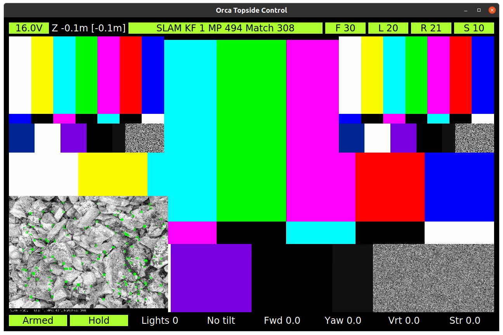

# Topside controller

The topside controller provides the following:
* display and/or record video from 1 or more cameras
* display system status
* provide keyboard and XBox controller input for ROV operation

See [teleop_node.hpp](include/orca_topside/teleop_node.hpp) for the list of parameters.

The ROS-standard `teleop_twist_joy` node supports more joysticks and will drive the ROV
by publishing `/cmd_vel` messages, but it will not set the camera tilt, 
turn on the lights, turn on the PID controller, etc.

## Display

The top bar (roughly: sensors) displays the following:
* Battery voltage
* Depth (z) actual and target
* SLAM status
* Forward camera fps
* Left camera fps
* Right camera fps
* SLAM debug image fps

The bottom bar (roughly: controls) displays the following:
* Disarmed vs armed
* Float vs hold
* Lights 0 (off) to 100 (full on)
* Camera tilt
* Forward (linear.x) velocity trim
* Yaw (angular.z) velocity trim
* Vertical (linear.z) velocity trim
* Strafe (linear.y) velocity trim

The main widget displays the images from the forward, left and right H.264 cameras,
as well as the debug output of the ORB SLAM system.
The various widgets must be enabled in the launch file.
Control the main widget using the function keys:
* F1, F2, F3 start / stop recording the forward, left or right camera
* F4, F5, F6, F7  show / hide the forward, left, right and SLAM widgets
* F8, F9, F10, F11 zoom the forward, left, right and SLAM widgets

## Additional keyboard controls

* ! toggles between arm / disarm
* @ toggles between hold / float
* ( and ) control the lights
* _ and + control the camera tilt
* e, s, d, f and c are arranged to mimic the XBox left joystick.
  They increment and decrement the forward and yaw trim.
  The d key sets forward and yaw trim to 0.
* i, j, k, l and , are arranged to mimic the XBox right joystick.
  They increment and decrement the vertical and strafe trim.
  The k key sets vertical and strafe trim to 0.

It is possible, if a little clunky, to operate the ROV only using the keyboard.

## Xbox joystick controls

* The menu button arms the ROV, the window button disarms the ROV
* The left stick sets desired velocity forward / reverse and yaw left / yaw right
* The right stick sets desired velocity up / down and strafe left / strafe right
* Trim up / down adds or subtracts vertical velocity in 0.1 m/s increments
* Trim left / right controls the lights
* The logo button cancels vertical trim
* Left and right bumper buttons controls the camera tilt in 15 degree increments
* A selects _float_ (hover thrust and PID controller disabled)
* B selects _hold_ (hover thrust and PID controller enabled)
* X disables the right stick up / down motion.
  This makes it easy to strafe while holding a vertical position.
  Use trim to control vertical velocity and position.
  The default is disabled.
* Y enables the right stick up / down motion

## Launch

~~~
cd ~/ros2/orca3_ws
source install/setup.bash
ros2 launch orca_bringup topside_launch.py
~~~
